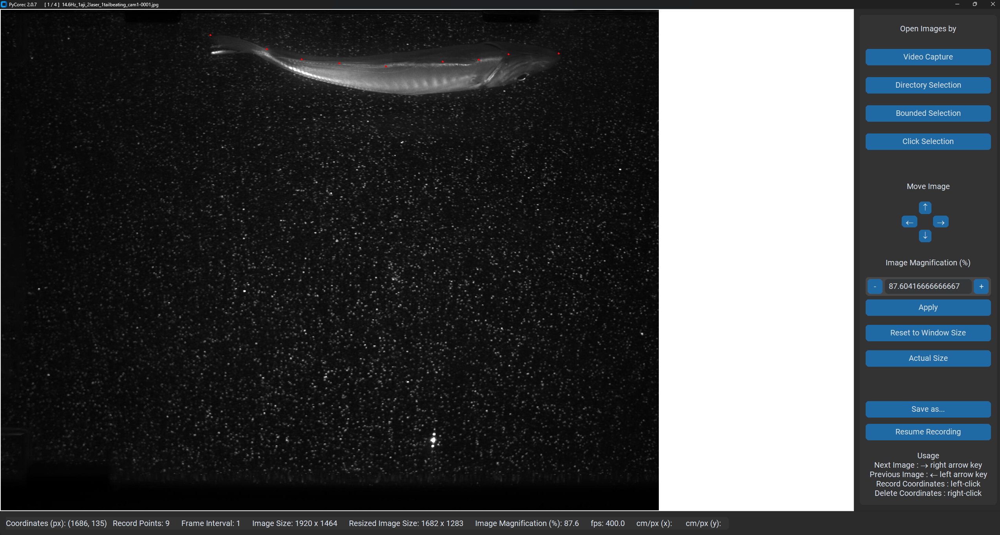
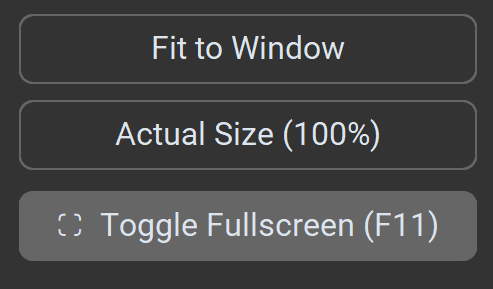
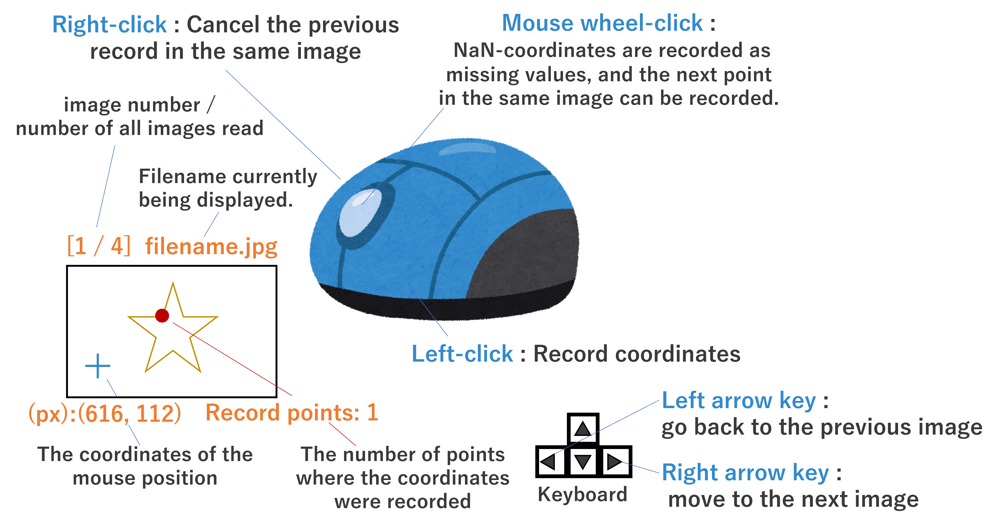
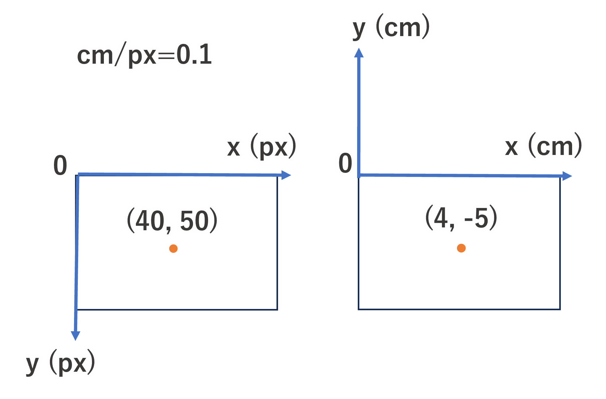

=======
PyCorec
=======

| Python Coordinates Recoder for Sequence Images (PyCorec)

| Version 2.0.7 (2023-11-30)

| PyCorec is a python GUI application that can read images with sequential numbers in the same file name, display them in numerical order, and record the coordinate points on the image using mouse operations.

Installation: how to install PyCorec
--------------------------------------------
| pycorec is available on PyPI. You can install it with pip

::

    pip install pycorec

Update
------------------
| pycorec is available on PyPI. You can update it with pip

::

    pip install --upgrade pycorec

How to use
------------------
Naming of image data🖼️
"""""""""""""""""""""""""
* When using sequential images in a time series, please add a sequential number to the end of the file name of the image data.
* This is not necessary when loading a video file.
* It is recommended that the images to be analyzed be placed under a single directory to be loaded at a time.
* Supports **.jpg, .png, .tiff, .bmp** image extensions.
* If the file name contains **"Bkg" and "Sub"**, the image will not be loaded.
* For time-series images, prepare files with the same file name followed by a number, so that the images with the lowest number are read in order.
        * Example
           * picture_001.jpg, picture_002.jpg, ......
           * pic-1.jpg, pic-2.jpg, ......
           * syashin1.jpg, syashin2.jpg, ......
           * mov_202308231159.jpg, mov_202308231201.jpg, ......
           * e 43.jpg, e 47.jpg, ......
           * Shashin (1).jpg, Shashin (2).jpg, ......

Launch the application💻
"""""""""""""""""""""""""
| Enter :code:`pycorec` in terminal on python environment installed pycorec.

::

    pycorec

Loading data📥
""""""""""""""""""
* Select one of the modes from the buttons on the right
   * Video capture (reads frames in the video)
   * Directory Selection (reads all images in a directory)
   * Bounded Selection (selects a range of images to load)
   * Click Selection (selectively load images)

   .. image:: ./docs/images/open.png
     :alt: open
   .. image:: ./docs/images/directory.png
     :alt: directory

* In the above three modes, a dialog box for setting the frame interval appears.
   * 1 for sequential loading, 2 for skipping one.

   .. image:: ./docs/images/interval.png
    :alt: interval

* Optional settings
   * Entering "fps" (frames per second, the reciprocal of the frame interval) creates a column of relative time (s).

   .. image:: ./docs/images/fps.png
    :alt: fps

   * If you enter cm/px (value at 100% image size), which indicates how many centimeters one px on the image corresponds to in reality, a value converted to the coordinate cm will be output.
      * If there is an object of known size on the image, it can be calculated by first reading only one image, taking a point, and dividing the distance between the two points (cm) by the difference in coordinates (px) for each x and y.

   .. image:: ./docs/images/cmpx.png
    :alt: cmpx

Change the screen display size📺
""""""""""""""""""""""""""""""""
* By default, the image is displayed at the largest size that fits the screen.
* Zoom in/out by pressing + and - on the right side panel or by specifying the display magnification with the value box and pressing "Apply".
* The up, down, left, and right arrow buttons can be used to move the image up, down, left, or right.
* Press "Reset to Window Size" to return to the initial size and position.
* Press "Fit image to Actual size" to display the image at 100% of its original size.
* The zoomed state is maintained and the image is moved to the next image.
* **Image coordinates are converted to the value at 100% image size no matter what size the image is displayed.**

Record the coordinates 🖱️
""""""""""""""""""""""""""""""""""""""""""
* Left-click to record coordinates
* right-click to cancel the previous record in the same image.
* When the mouse wheel is pushed in, nan-coordinates are recorded as missing values, and the next point in the same image can be recorded.
* The point where the coordinates were acquired is displayed as a red dot.
* The number of points recorded in the image is displayed as Record Points in the bar at the bottom.
* When the recording of coordinates in an image is finished, press the right arrow key→ to move to the next image.
* When the left arrow key is pressed to go back to the previous image.
* The title bar at the top displays the image number / number of all images read & the name of the image file currently being displayed.
* The coordinates of the mouse position and other information are displayed at any time at the bottom of the screen.

Save the coordinate data 💾
""""""""""""""""""""""""""""""""
* When recording is finished with the last image, press → again to open the file save screen.
* Or press Save as... in the lower right corner to save the data up to that point. to save the coordinates recorded up to that point.
* To interrupt coordinate recording, press Save as to output the coordinate recording file, and when resuming, press Resume Recording to read the file you have just output.
* If the path to the image file changes, it cannot be loaded. In the case of video, the output image file is referenced. Please correct the FilePath column in the coordinate record file using the Replace function, etc., and then read the file again.
* Output file can be selected from xlsx or csv.
* Image coordinate px is the origin at the upper left of the image, x-axis is positive rightward, and y-axis is positive downward as per the standard.
* When outputting in physical coordinates cm, the origin is the upper left corner of the image, the x-axis is positive rightward, and the y-axis is positive upward.
   * For the position on the image, x: positive value cm, y: negative value cm

Release
------------------
| Version 2.0.7 (2023-11-30)

* Enable to read video and get frames.
* Added a function to resume recording based on the information in the coordinate recording file saved after interrupting recording in the middle.

| Version 2.0.6 (2023-10-31)

* Fixed to be able to run from terminal.

| Version 2.0.5 (2023-10-30)

* Release on pypi

| Version 2.0.4 (2023-09-15)

* Add mouse wheel click function to record nan position

| Version 2.0.3 (2023-08-07)

* cm/px can now be specified separately for x and y.
* If x=y, the same value must be entered for both, and no conversion will be performed unless valid values are entered for both xy and y.
* The number of record points in the displayed image is displayed as Record points in the bottom bar.
* Fixed a problem in which the screen would overflow when connected to multiple monitors with a magnification factor other than 100%.
* When Excel output is selected, the following settings are available.
* (Old) Vertical sheet of time-series changes per point +
* (New) a sheet of spatial distribution of multiple points per time frame, arranged vertically.

| Version 2.0.2 (2023-07-04)

* Bug fixes and UI improvements
* published on GitHub https://github.com/tnku10/pycorec

  **UI**
* Moved image number/number of all images loaded & the name of the currently displayed image file from the bottom to the title bar.
* Simplified button descriptions.
* To prevent accidental operation, the mouse wheel zoom has been removed and replaced with a + - numerical value box.
* The zoom size of the image display can now be specified numerically.
* The image display zoom size can now be specified numerically.

  **Bug Fix**
* Fixed a bug that the dialog box is not displayed when the file specification is canceled.
* Fixed a bug that a point can't be typed before an image is displayed.
* Fix - Cannot return to the previous image from the first image.
* Fixed so that coordinate records are maintained correctly even if you go back to the previous image, and display dots of record points are also maintained.

  **Output File**
* Fonts of output file are changed to Segoe UI for better viewing, columns of File name are added, image size is added, and xlsx and csv are selectable.

| Version 2.0.1 (2023-06-27)

* GUI modernized to allow zooming in and out, moving the image forward and backward
* GUI engine changed from tkinter to customtkinter
* Changed image processing engine from opencv to pillow.
* Changed so that a dot is drawn on the image when clicked.

| Version 1.0.6 (2022-02-24)

* Changed so that pressing the key does not move to the next image unless one point per image is recorded for the second and subsequent images. (This is a measure to avoid a situation in which the user presses a key to move on without clicking and cannot return to the previous image, but must start over from the beginning.)

| Version 1.0.5 (2022-02-03)

* Added functions to input frame rate (fps) and physical coordinate conversion scale (cm/px) values, and to output physical coordinates (cm) and relative time (s) in the y-axis forward downward direction.
* Changed reading mode to A "Folder selection (batch selection of images in folder)", B "File selection (continuous range selection)", and C "File selection (multiple and arbitrary selection possible)".
* Enabled to load images with a specified frame interval for any continuous range in folder B in addition to A.

| Version 1.0.4 (2022-02-02)

* Limit the number of rows and columns of the data frame displayed when clicking on an image to only 3 rows and 6 columns (x,y for 3 points).

| Version 1.0.3 (2022-02-01)

* Changed so that images containing "Bkg" in the file name are not loaded.
* Changed so that csv can be saved before force close
* Changed so that the csv save screen is displayed after all images are displayed.
* Changed the skip number specification e.g.) If the number of images to load is 001,003,005, the skip number is > 2.

| Version 1.0.2 (2022-02-01)

* Added support for file paths containing Japanese characters (modified to read via Numpy)
* Add real-time mouse position image coordinate display function
* Add image skip reading mode
* Added ability to specify image magnification

| Version 1.0.1 (2022-01-28)

* First release

Future update
------------------

Credits
-------
| Programmed by Yuto Tanaka

This package was created with Cookiecutter_ and the `audreyr/cookiecutter-pypackage`_ project template.

.. _Cookiecutter: https://github.com/audreyr/cookiecutter
.. _`audreyr/cookiecutter-pypackage`: https://github.com/audreyr/cookiecutter-pypackage
